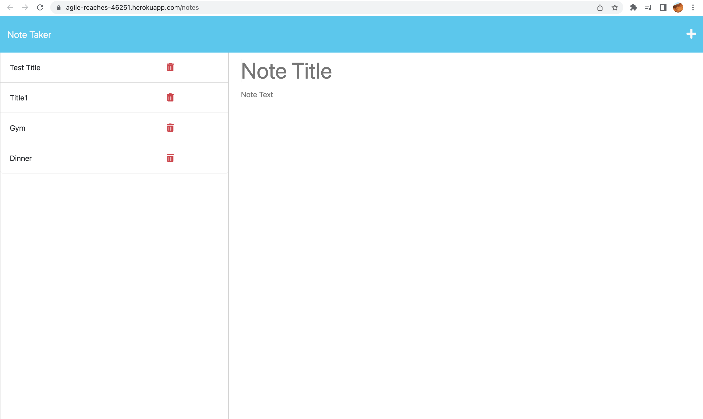

<h1>noteTaker</h1>

## Table of Contents

  * [Description](#description)
  
  * [Installation](#installation)

  * [Usage](#usage)

  * [Links](#links)

  * [Questions](#questions)

## Description

- My motivation to create this application so that a user could write and save notes to stay organized and keep track of their tasks.
- I built this project to expand my knowledge in javasript and how to implement Heroku in order to be able to implement an api.
- It allows user to create notes and delete them upon comletion of the task.
- Learned how to deploy Heroku and save and delete user input via api calls.

## Installation

- Clone code from GitHub repository:
- Copy Heroku/link. 

## Usage
  
 - Once on noteTaker page, type in the title in the text field that says "Note Title" then type in the note in the in the field below "Note Text." To save the note click the floppy disk icon on the top, righ-hand corner. Notes will appera in a column on the left hand side of the page. To delete any notes click the trash-can icon. 

    
 

## Links

- GitHub: https://github.com/Caliza/teamProfileGenerator
- Heroku: https://drive.google.com/file/d/1ALz30f3SrgSaZBSmH7cDouA3KW2eJBVD/view?usp=share_link

## Questions

- For any additional questions on usage of application, please contact at rances.rodriguez@gmail.com.